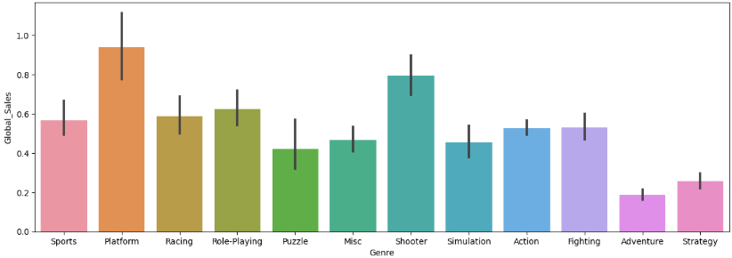

# 🎮 Video Game Sales - EDA & Feature Engineering

## 🎯 Problem Description

There are a lot of videogames in the market, and this is a industry that is growing exponentially, but we don't know exactly which features a game must have to succced.

## 🔧 Proposed Solution

Conducting an exploratory analysis and creating various graphics to gain insights in a visual and intuitive way that anyone can understand. Creating better features to make a better model.

## 📊 Principal Results

- Tha game with the most sales globally: Wii Sports
- Distribution totally abnormal, with only a few games with more than 10 million sales
- Best Selling Genre: Platform

## 🛠 Technologies Used

- Python 3.9+
- Pandas - Data Wrangling and Feature Engineering
- Matplotlib/Seaborn - Visualizations
- Jupyter - Interactive Analisis

## 📈 Methodology

1. EDA: Exploratory Data Analysis
2. Data Cleaning: Searching and cleaning missing data, parsing dates, fixing the ranking
3. Graphs with matplotlib: View data visually and intuitively
4. Feature Engineering: Normalizing and scaling data

## 🔍 Conclusions and learnings

- The vast majority of games sell less than $10 million, only 1% are able to sell more.
- Adventure and strategy are the genres that are least worth it if you want to sell.
- Nintendo totaly domain the market, with a lot of their games in the top of the ranking.

## 📞 Contact me

**Jesus Daniel Mendez Garatuza**

- LinkedIn: https://www.linkedin.com/in/daniel-mendez-0b7944358
- Email: danielmendez1708@hotmail.com

⭐ If you find this project useful, don't forget to give it a star.
